# 国内器物案例展示与出处索引

本页统一采用“原器物图—人工/原报告线图—本 skill 独立重绘”的三联对照，展示青铜器、陶器、瓷器和瓦当的绘图信息如何从实物证据进入线图。原器物图与原报告图版是外部参考素材；独立重绘稿只用于考古绘图方法学习、技术验证和查漏补缺，不等同于正式发表图版，也不替代有实物和测量条件的考古实测图。

## 1. 瓦当

详细学习记录：[瓦当 8a1 案例](wadang-case-8a1.md)。

出处线索：[用户提供的微信公众平台文章](https://mp.weixin.qq.com/s/A89_89I7ZpqnMmI08Rsf6g)。瓦当原器物照片和带尺寸人工手绘图均由用户提供；当前只将用户明确要求的必要对照素材纳入案例。图中尺寸信息包括当径 16、当心径 6、边轮宽 0.9、边轮厚 1.9、当厚 1.5、纹/缝深 0.6 厘米，正式使用前仍应以原始测量记录复核。

### 原器物图（用户提供）

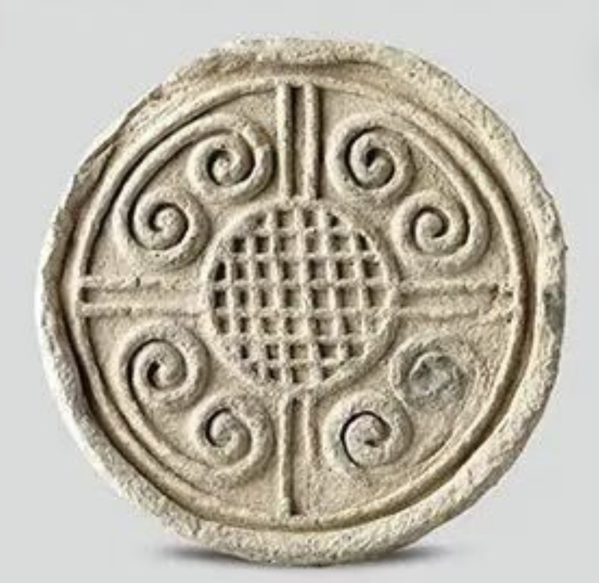

### 人工手绘/尺寸参考图（用户提供）

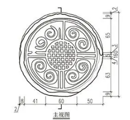

### 本 skill 独立重绘（SVG 矢量主稿）

[查看/下载瓦当 SVG 矢量主稿](../assets/examples/wadang-8a1-archaeological-plate-v1.svg)

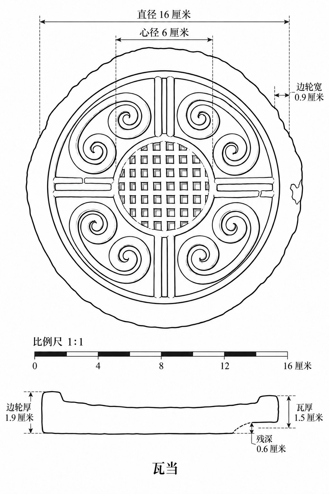

本例重点：以中心轴、同心结构、四分布局和云纹证据组织圆形密集纹饰；锈蚀、包浆、反光和背景不进入线图，但锈蚀下仍可辨认的纹饰必须保留；不可辨认处不按常见瓦当纹样补造。

## 2. 青铜器｜三星堆 K3QW：1 青铜大口尊

出处：[《四川文物》2024 年第 4 期〈考古中国〉](https://www.sckg.com/uploads/soft/20240924/2-240924145943M8.pdf)。原器物图与人工/原报告线图取自同一公开报告图版的对应素材；本稿重点检查宽口、长颈、腹部、器座、附饰、纹饰分带和半剖面。绿锈、摄影支撑物和背景不进入结构线。

### 原器物图（原报告图版裁图）

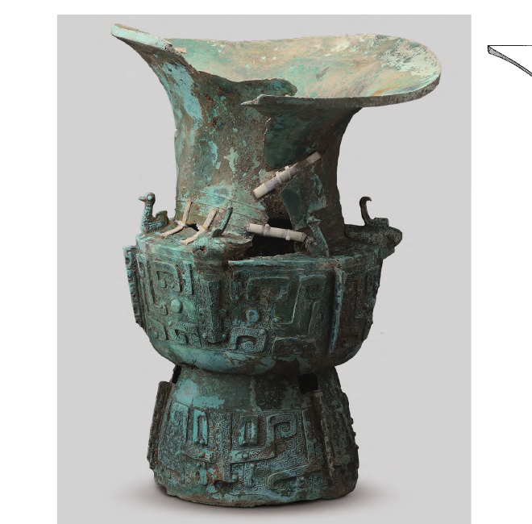

### 人工手绘/原报告线图

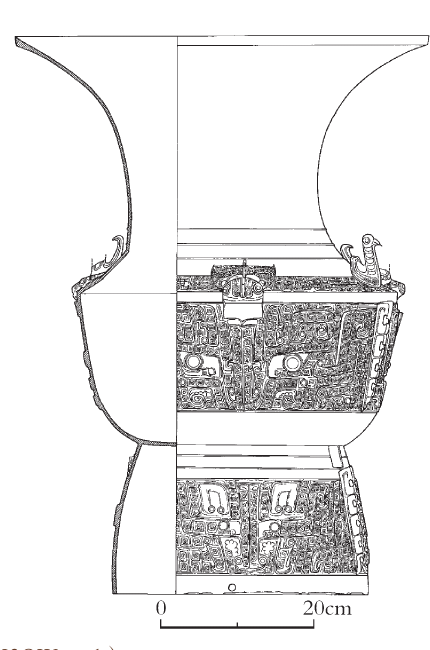

### 本 skill 独立重绘（SVG 矢量主稿）

[查看/下载青铜大口尊 SVG 矢量主稿](../assets/examples/domestic-bronze-k3qw1-independent.svg)

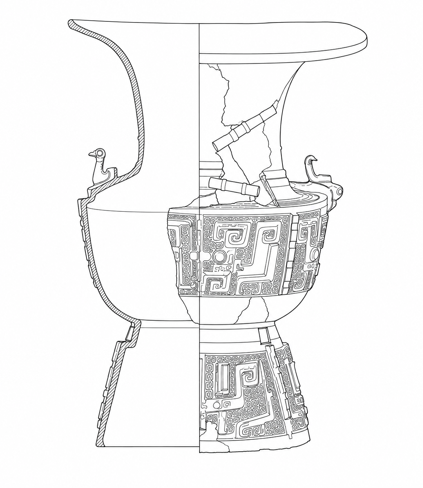

## 3. 陶器｜小红门 M1：3 陶鼎

出处：[《北京市朝阳区小红门金代墓葬发掘简报》](https://wwj.beijing.gov.cn/bjww/resource/cms/article/bjww_362762/325981205/2026020515482856873.pdf)。原器物图与人工/原报告线图取自公开报告图版的同标本素材；本稿重点检查三足、口沿、鼓腹、器壁和残损的半剖表达。土色、修补色块和摄影阴影不转译为结构线，照片不能独立支持的后部关系保留为待复核信息。

### 原器物图（原报告图版裁图）

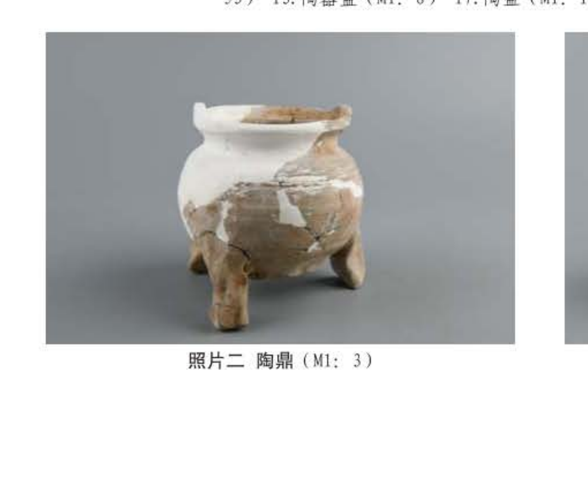

### 人工手绘/原报告线图

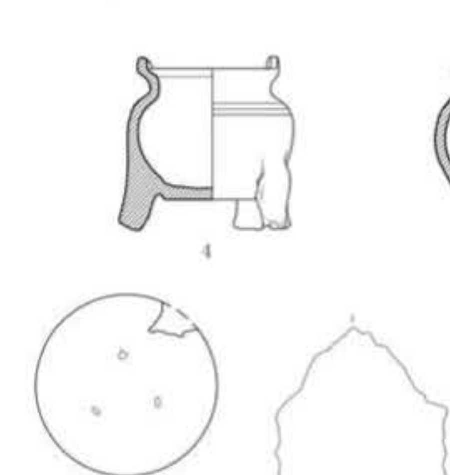

### 本 skill 独立重绘（SVG 矢量主稿）

[查看/下载陶鼎 SVG 矢量主稿](../assets/examples/domestic-pottery-ding-m1-3-independent.svg)

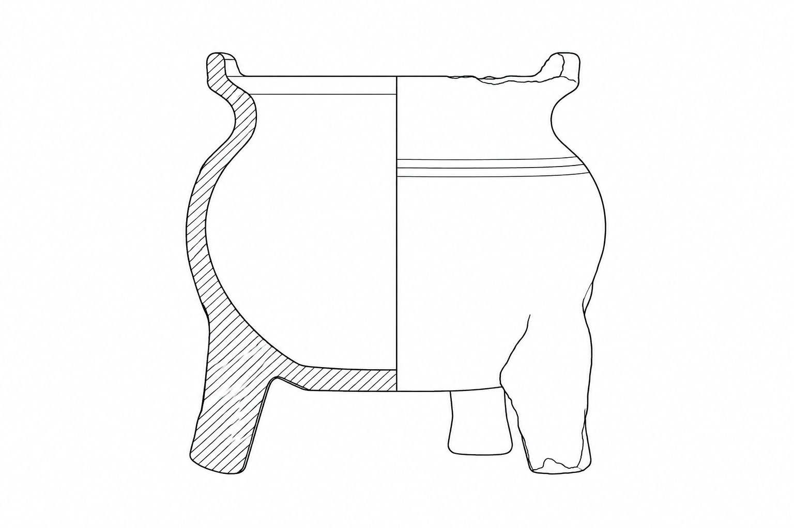

## 4. 瓷器｜小红门 M1：1 瓷碗

出处：[《北京市朝阳区小红门金代墓葬发掘简报》](https://wwj.beijing.gov.cn/bjww/resource/cms/article/bjww_362762/325981205/2026020515482856873.pdf)。原器物图与人工/原报告线图取自公开报告图版的同标本素材；本稿用平面、正视和半剖面表达口沿、浅弧腹、矮圈足和器壁。青釉、流釉、光泽和摄影阴影不涂成黑块，只有同标本正式图版或实测支持的隐藏结构才可进入辅助视图。

### 原器物图（原报告图版裁图）

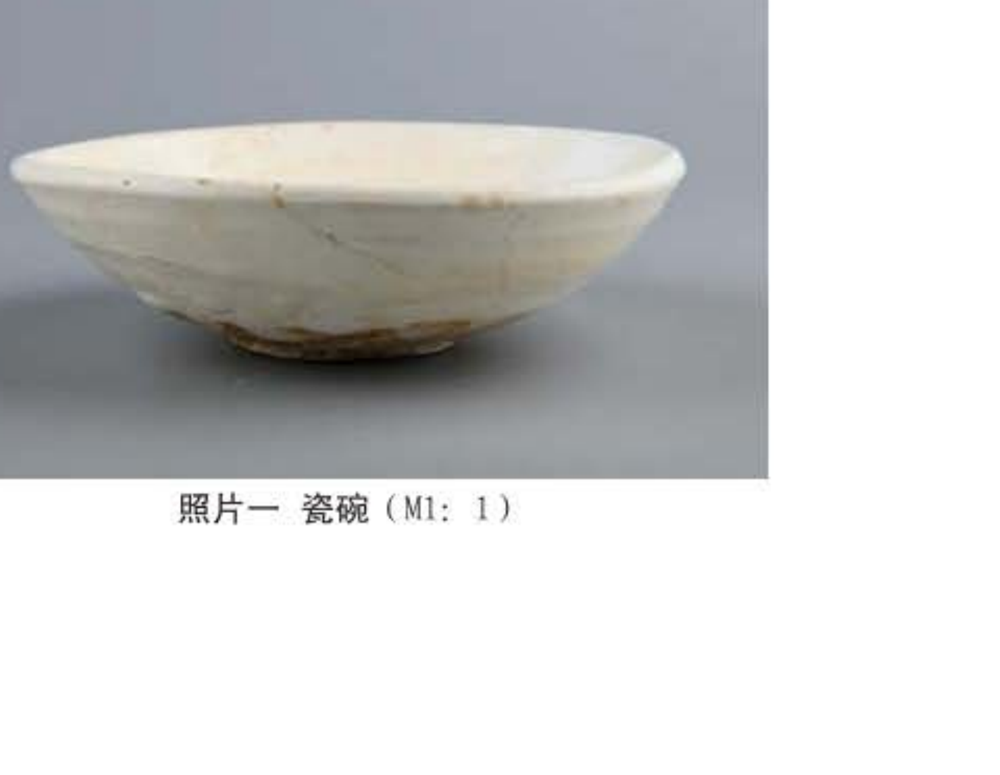

### 人工手绘/原报告线图

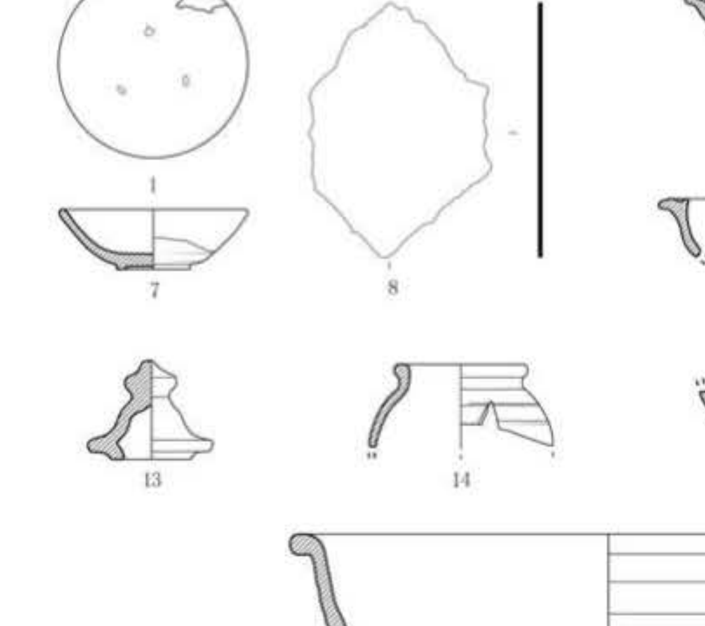

### 本 skill 独立重绘（SVG 矢量主稿）

[查看/下载瓷碗 SVG 矢量主稿](../assets/examples/domestic-porcelain-bowl-m1-1-independent.svg)

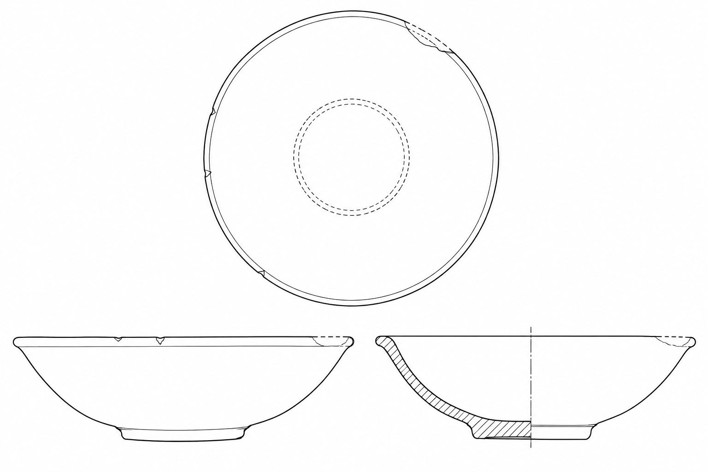

## 说明与版权联系

瓦当的原器物图和人工手绘图属于用户提供的案例素材；其余原器物图和原报告线图来自上列公开报告链接的必要裁图。所有外部照片、报告文字、正式发表线图及相关资料的著作权、署名权和其他权利归原权利人所有，本仓库不主张对原始资料享有权利。独立重绘稿是本 skill 的学习/技术验证稿，不冒充原作者成品。

如您认为相关内容涉及侵权、署名不完整、出处链接失效或不宜公开，请联系开发者/仓库维护者，可通过本仓库提交 Issue；我们将及时核查，并按要求补充署名、修改或删除相关内容。

