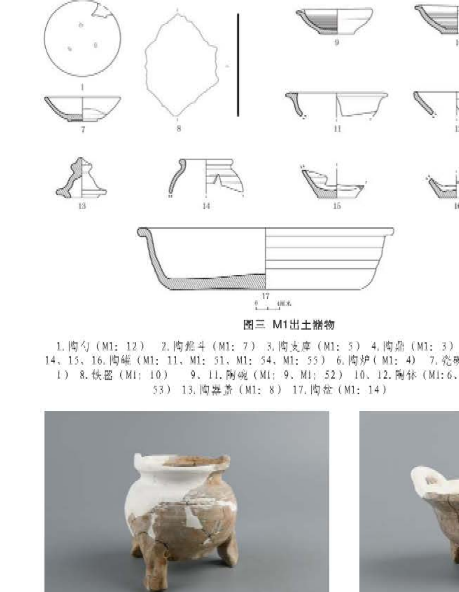
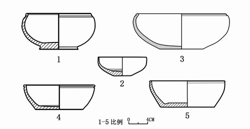
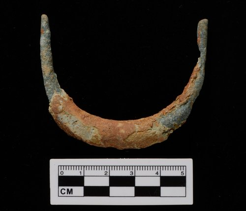
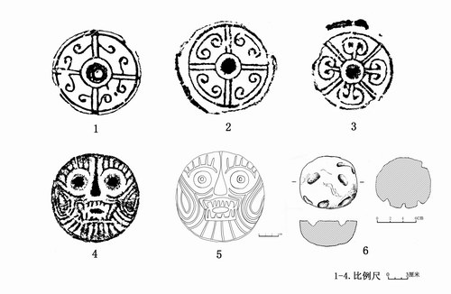
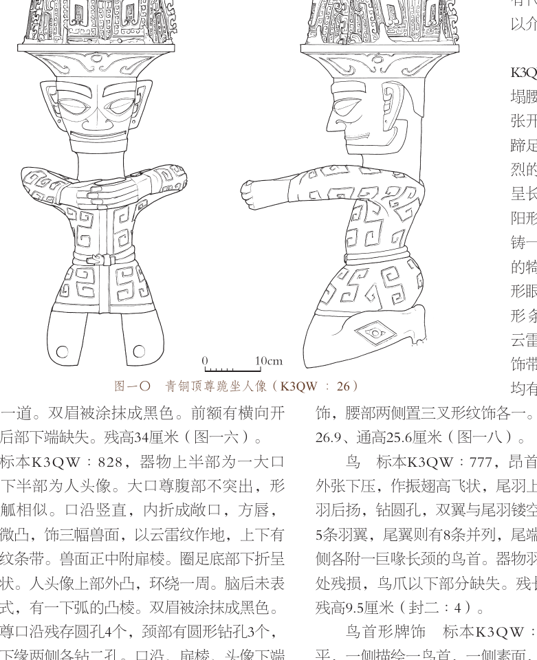
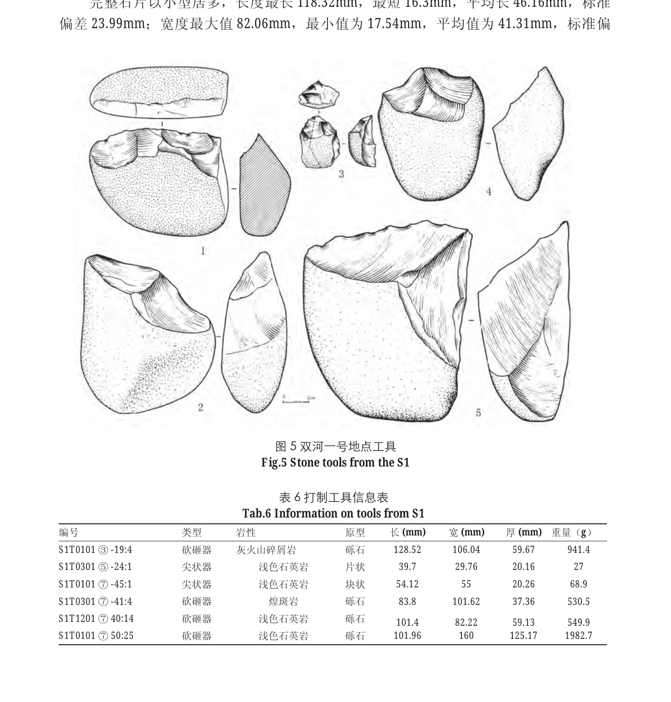

# 国内器物案例展示与出处索引

本页统一采用“原器物图—人工/原报告线图—本 skill 独立重绘”的三联对照，展示青铜器、陶器、瓷器和瓦当的绘图信息如何从实物证据进入线图。当前包含 3 个基于国内正式资料的独立验证案例，以及 1 个使用用户直接提供国内器物资料的瓦当验证典例；两类来源身份分开标注，均不等同于正式发表图版，也不替代有实物和测量条件的考古实测图。

其中“原器物图”和“官方绘图”必须优先回到同一份国内正式资料的原始版面核验：下列本地图片是为便于对照而做的必要裁图，原报告整页、页码、图号和标本号才是出处依据。官方图版中的比例尺只说明原报告的发表尺度，不能直接套到新的独立重绘上。

## 1. 瓦当

详细学习记录：[瓦当 8a1 案例](wadang-case-8a1.md)。

出处线索：[用户提供的微信公众平台文章](https://mp.weixin.qq.com/s/A89_89I7ZpqnMmI08Rsf6g)。瓦当原器物照片和带尺寸人工手绘图均由用户提供；当前只将用户明确要求的必要对照素材纳入案例。图中尺寸信息包括当径 16、当心径 6、边轮宽 0.9、边轮厚 1.9、当厚 1.5、纹/缝深 0.6 厘米，正式使用前仍应以原始测量记录复核。

### 原器物图（用户提供）

### 人工手绘/尺寸参考图（用户提供）

### 本 skill 独立重绘（SVG 矢量主稿）

[查看/下载瓦当 SVG 矢量主稿](../assets/examples/wadang-8a1-archaeological-plate-v1.svg)

本例重点：以中心轴、同心结构、四分布局和云纹证据组织圆形密集纹饰；锈蚀、包浆、反光和背景不进入线图，但锈蚀下仍可辨认的纹饰必须保留；不可辨认处不按常见瓦当纹样补造。

## 2. 青铜器｜三星堆 K3QW：1 青铜大口尊

出处：[《四川文物》2024 年第 4 期〈考古中国〉](https://www.sckg.com/uploads/soft/20240924/2-240924145943M8.pdf)，印刷页 009（PDF 第 6 页）图六“青铜大口尊（K3QW∶1）”。该原始版面左侧为原器物照片，右侧为同标本官方发表线图，并列标有 0—20 cm 比例尺；本地图片是从该版面做的必要裁图。本稿重点检查宽口、长颈、腹部、器座、附饰、纹饰分带和半剖面。绿锈、摄影支撑物和背景不进入结构线。

### 原器物图（原报告图版中的照片，必要裁图）

### 官方发表线图（原报告图版，必要裁图）

### 本 skill 独立重绘（SVG 矢量主稿）

[查看/下载青铜大口尊 SVG 矢量主稿](../assets/examples/domestic-bronze-k3qw1-independent.svg)

## 3. 陶器｜小红门 M1：3 陶鼎

出处：[《北京市朝阳区小红门金代墓葬发掘简报》](https://wwj.beijing.gov.cn/bjww/resource/cms/article/bjww_362762/325981205/2026020515482856873.pdf)，印刷页 45（PDF 第 51 页）图三及照片二“陶鼎（M1∶3）”。图三第 4 号为 M1∶3 的官方发表线图，照片二为同标本原器物照片；本地图片是原报告版面的必要裁图。本稿重点检查三足、口沿、鼓腹、器壁和残损的半剖表达。土色、修补色块和摄影阴影不转译为结构线，照片不能独立支持的后部关系保留为待复核信息。

### 原器物图（原报告图版中的照片，必要裁图）

### 官方发表线图（原报告图版，必要裁图）

### 本 skill 独立重绘（SVG 矢量主稿）

[查看/下载陶鼎 SVG 矢量主稿](../assets/examples/domestic-pottery-ding-m1-3-independent.svg)

## 4. 瓷器｜小红门 M1：1 瓷碗

出处：[《北京市朝阳区小红门金代墓葬发掘简报》](https://wwj.beijing.gov.cn/bjww/resource/cms/article/bjww_362762/325981205/2026020515482856873.pdf)，印刷页 44—45（PDF 第 50—51 页）图三第 7 号及照片一“瓷碗（M1∶1）”。照片一位于印刷页 44，官方发表线图位于图三第 7 号；本地图片是原报告版面的必要裁图。本稿用平面、正视和半剖面表达口沿、浅弧腹、矮圈足和器壁。青釉、流釉、光泽和摄影阴影不涂成黑块，只有同标本正式图版或实测支持的隐藏结构才可进入辅助视图。

### 原器物图（原报告图版中的照片，必要裁图）

### 官方发表线图（原报告图版，必要裁图）

### 本 skill 独立重绘（SVG 矢量主稿）

[查看/下载瓷碗 SVG 矢量主稿](../assets/examples/domestic-porcelain-bowl-m1-1-independent.svg)

## 5. 补库配对学习资料（不冒充独立重绘）

本节收录压缩包中可回到国内正式页面/报告核验的补充分支。它们用于学习材质、形态、图版角色和证据分层；没有完成独立重绘的对象不写成“三联对照”，也不把官方线图当成本 skill 成品。

### 铜镜 M27：1、青花碗 M34：3｜半壁店

两件对象的出处均为[《北京市通州区梨园镇半壁店旧村明清墓葬发掘简报》](https://wwj.beijing.gov.cn/bjww/resource/cms/article/362762/515640/2018052316220684054.pdf)。压缩包中对应的两组裁图经逐张查看后发现文件内容与文件名错配：铜镜“原图”实际为青花器物，“线图”实际为墓葬分布图；青花碗“原图”实际为文字裁图，“线图”实际为小红门图三。因此本次不展示这些错误配对，也不把它们上传为正式案例素材；审计记录见[优化包素材审计记录](optimization-package-audit.md)。

### 陶炉 M1：4｜小红门

来源为[《北京市朝阳区小红门金代墓葬发掘简报》](https://wwj.beijing.gov.cn/bjww/resource/cms/article/bjww_362762/325981205/2026020515482856873.pdf)。目前只保留可核对的图三整版官方图版，用于学习三足器的口沿、足部、附属构件和组合编号；压缩包所谓“原图”不是原器物照片，故不做照片—线图配对。

### 渡头古城瓦当、陶器与青瓷器｜图一五—图一七

来源为[湖南省文化和旅游厅《湖南省临武县渡头古城遗址考古发掘》](https://whhlyt.hunan.gov.cn/whhlyt/news/gzdt/201812/t20181214_5372142.html)。官方网页明确列出图一五“陶器、青瓷器线图”、图一六“瓦当”和图一七“瓦当、陶球拓片及线图”；其中瓦当分涡纹、卷云纹、人面纹、花瓣纹四类，并给出部分直径/当心径。三张图按角色重新命名，不能把拓片黑白反差当成结构线。

### 顶尊跪坐人像 K3QW：26｜三星堆

来源为[《四川文物》2024 年第 4 期〈考古中国〉](https://www.sckg.com/uploads/soft/20240924/2-240924145943M8.pdf)图一〇。当前素材可核对为官方图版中的线图部分，未提供可独立配对的原器物照片；它用于演练人形专项规程的头身、冠饰、衣饰、持物、共同基准和结构分层，不称为本 skill 独立重绘。

### 双河一号打制石器｜图五工具线图

来源为[《人类学学报》2016 年第 35 卷第 3 期](https://ivpp.cas.cn/cbw/rlxxb/xbwzmj/201604/P020160921381585065485.pdf)。压缩包中的“图四”裁图图注实际显示为图三，故不纳入；图五工具线图图注可核对，保留为打制石器的台面、剥片疤、叠压和刃缘修理学习资料。该对象没有照片—线图配对，不强行补照片。

## 说明与版权联系

瓦当用户素材、国内报告裁图、政府网页图版和期刊图版的权利与处理方式统一见[公开素材署名与权利处理](legal-note.md)。如您认为相关内容涉及侵权、署名不完整、图号配对错误、出处链接失效或不宜公开，请通过仓库 Issue 联系开发者/维护者；我们将及时核查并按要求补充署名、修正或删除。
